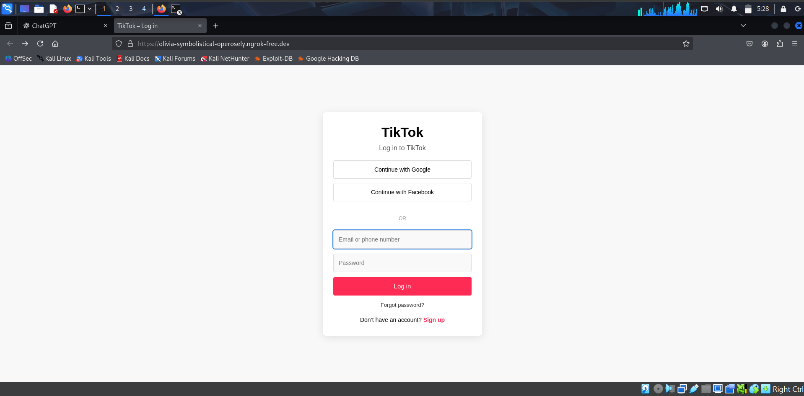
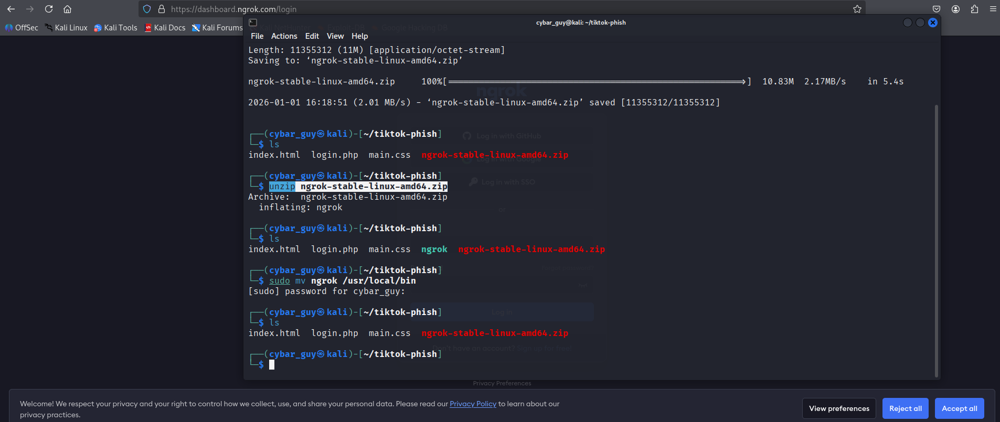
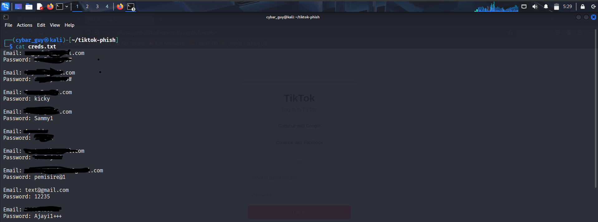

# Phishing Awareness & Social Engineering Simulation

This project demonstrates how attackers use fake login pages and social engineering to harvest credentials, and how users can be trained to recognize and avoid these attacks.

This lab was conducted in a **controlled and ethical environment** for cybersecurity awareness and educational purposes only.

## Infrastructure Overview

The lab used a lightweight web server to host a cloned login page. 
A secure tunneling service (Ngrok) was used to expose the local server to the internet, simulating how attackers host phishing pages on external infrastructure.

User interactions were logged in order to measure how quickly phishing attempts succeed and to demonstrate the risks of credential reuse.

No real credentials were stored, and all participants were informed immediately after the test.


## Architecture (Diagram)

```
Victim Browser
      |
      v
Phishing Page (HTML/CSS)
      |
      v
Ngrok Tunnel
      |
      v
Local Lab Server
      |
      v
Logging & Analysis
```


## Objective
- Simulate a real-world phishing scenario
- Observe how users interact with phishing links
- Demonstrate how easily credentials can be exposed
- Train users to detect phishing attempts

## What was built
- Social-engineering messages to simulate attacker behavior

 

- A TikTok-style login page clone using HTML and CSS

 

- A backend that records form submissions (for demonstration only)

 

 

- Awareness training for participants

## What was learned
- How phishing exploits trust and urgency
- How URL masking and fake login pages are used
- Why technical defenses alone are not enough
- How awareness reduces successful attacks

## Ethical Notice
No real accounts were compromised. All participants were informed immediately after the test and advised to change any test passwords used.

This project is for defensive security education only.
